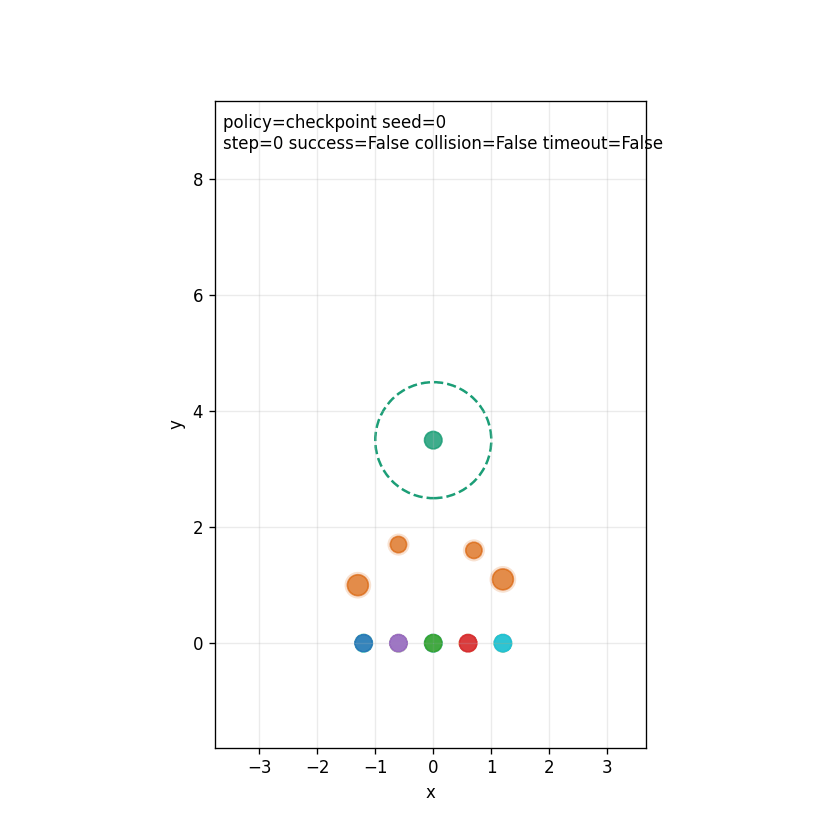

# Policy-Guided Multi-Agent Encirclement Control

这是论文 **A Policy-Guided Reinforcement Learning Method for Encirclement Control in Multiobstacle Environment** 的代码复现工程。

本仓库不是原论文的模型车/ROS/Gazebo 完整仿真复刻，而是按照论文核心思想实现的二维平面圆形环境版本：追捕者、目标和障碍物均建模为圆，重点复现“策略引导 + 强化学习围捕”的算法流程。

## 当前实现效果

已实现并可运行的内容：

- 二维多追捕者围捕环境，包含追捕者、目标、障碍物、碰撞检测、围捕判定。
- 策略引导机制：APF/environment.py 风格引导策略与 Stage-2 channel guide。
- residual MAPPO 训练：以引导策略为 nominal action，神经网络学习残差修正。
- 引导比例衰减训练流程，近似论文中的 policy-guided reinforcement learning。
- 集中式 critic、共享 actor、多智能体 rollout、GAE/PPO 更新。
- 多 GPU 服务器启动脚本，每张 GPU 独立跑一组随机种子。
- 评估指标：成功率、碰撞率、超时率、围捕时间、最终距离误差、角度误差、障碍物安全距离、追捕者间安全距离、通信消息量估计。
- GIF/HTML/MP4 可视化，其中 GIF 不需要系统 ffmpeg。

在当前 `v3 channel` 场景中，5 个追捕者可在多障碍二维平面中完成围捕。4 个服务器 checkpoint 的 300 episode 评估结果均为：

| checkpoint | success_rate | collision_rate | timeout_rate | encirclement_time |
|---|---:|---:|---:|---:|
| gpu0 best | 1.000 | 0.000 | 0.000 | 16.718 |
| gpu1 best | 1.000 | 0.000 | 0.000 | 16.726 |
| gpu2 best | 1.000 | 0.000 | 0.000 | 16.583 |
| gpu3 best | 1.000 | 0.000 | 0.000 | 18.224 |

速度压力测试中，channel guide 在 `target_speed = 0.00, 0.05, 0.10, 0.15, 0.20, 0.25` 下均达到 `success_rate = 1.0`，对应摘要见 [results/reference_metrics](results/reference_metrics)。

代表性围捕效果如下：



更多 GIF 位于 [assets](assets)。

## 数学建模

### 平面运动模型

原论文涉及模型车和仿真平台；本工程按用户要求简化为二维平面圆形环境。第 `i` 个追捕者的位置、速度和动作分别为：

```math
p_i(t) = [x_i(t), y_i(t)]^\top,\quad
v_i(t) = [v_{x,i}(t), v_{y,i}(t)]^\top,\quad
a_i(t) = [a_{x,i}(t), a_{y,i}(t)]^\top
```

使用离散二阶积分近似状态转移：

```math
v_i(t+1) = \operatorname{clip}(v_i(t) + a_i(t)\Delta t,\ -v_{\max},\ v_{\max})
```

```math
p_i(t+1) = p_i(t) + v_i(t+1)\Delta t
```

其中 `clip` 用于速度限制，动作也会被限制在最大加速度范围内：

```math
\|a_i(t)\|_\infty \le a_{\max}
```

目标位置和速度记为 `p_T(t), v_T(t)`。当前主线支持固定目标和低速移动目标，但不复现原论文的真实车辆动力学。

### 围捕判定

围捕目标是让 `N` 个追捕者在目标周围形成近似等角度环形队形。设期望围捕半径为 `R_c`，追捕者相对目标的距离为：

```math
d_i(t) = \|p_i(t) - p_T(t)\|_2
```

距离误差：

```math
e_d(t) = \frac{1}{N}\sum_{i=1}^{N} |d_i(t) - R_c|
```

追捕者相对目标的极角：

```math
\theta_i(t) = \operatorname{atan2}(y_i(t)-y_T(t), x_i(t)-x_T(t))
```

排序后的相邻角度间隔应接近：

```math
\Delta\theta^\* = \frac{2\pi}{N}
```

角度误差近似为：

```math
e_\theta(t) =
\frac{1}{N}\sum_{i=1}^{N}
\left|\operatorname{wrap}(\theta_{i+1}(t)-\theta_i(t))-\frac{2\pi}{N}\right|
```

当距离误差、角度误差均小于阈值，并且无追捕者碰撞、无障碍物碰撞时，判定为围捕成功：

```math
e_d(t) \le \epsilon_d,\quad
e_\theta(t) \le \epsilon_\theta,\quad
\text{collision}(t)=0
```

### 碰撞与安全距离

追捕者和障碍物均为圆。追捕者半径为 `r_p`，障碍物半径为 `r_o`。追捕者间碰撞条件：

```math
\|p_i - p_j\|_2 \le 2r_p,\quad i \ne j
```

追捕者与障碍物碰撞条件：

```math
\|p_i - p_o\|_2 \le r_p + r_o
```

评估中还记录最小障碍物净空和最小追捕者间净空，用来判断策略是否只是“擦边成功”。

## 策略引导方法

代码中实现了两类引导：

- `APFGuidePolicy`：人工势场风格策略。
- `Stage2ChannelGuidePolicy`：在 APF 基础上加入障碍带通道 waypoint，使追捕者先绕过障碍区域，再回到围捕队形。

APF 引导可以抽象为：

```math
a_i^{guide}
= a_i^{target} + a_i^{formation} + a_i^{obstacle} + a_i^{safety}
```

目标吸引项使追捕者靠近目标或目标附近的围捕槽位：

```math
a_i^{target} = k_t(p_i^{slot} - p_i) - k_v(v_i - v_T)
```

障碍物斥力项在追捕者进入障碍影响范围 `d_0` 后生效：

```math
a_{i,o}^{obstacle}
= k_o\left(\frac{1}{d_{i,o}}-\frac{1}{d_0}\right)
\frac{p_i-p_o}{d_{i,o}^3},\quad d_{i,o}<d_0
```

其中：

```math
d_{i,o} = \|p_i - p_o\|_2
```

Stage-2 channel guide 不是论文额外声明的公式，而是工程近似：在障碍物带附近为不同排序的追捕者分配通道点，先引导其通过障碍区域，再切换回围捕槽位控制。

## 强化学习理论方法

### Dec-POMDP 建模

该问题被实现为多智能体部分可观测强化学习任务，可近似表示为 Dec-POMDP：

```math
\mathcal{M} =
\langle
\mathcal{S},
\{\mathcal{A}_i\}_{i=1}^{N},
\{\mathcal{O}_i\}_{i=1}^{N},
P,
\{R_i\}_{i=1}^{N},
\gamma
\rangle
```

其中：

- `S`：全局状态，包括全部追捕者、目标和障碍物的位置/速度。
- `O_i`：第 `i` 个追捕者的局部观测，包括自身状态、目标相对位置/速度、其他追捕者相对信息、障碍物相对信息。
- `A_i`：第 `i` 个追捕者的二维连续加速度动作。
- `P`：由二维积分动力学和目标运动规则定义的状态转移。
- `R_i`：围捕奖励、碰撞惩罚、距离/角度 shaping 奖励。
- `γ`：折扣因子。

训练采用集中式训练、分布式执行思想：critic 可以使用拼接后的全局观测，actor 在执行时按每个智能体的局部观测输出动作。

### residual policy

当前主线不是让神经网络从零输出全部动作，而是学习引导策略的残差修正：

```math
a_i(t) = a_i^{guide}(t) + \lambda a_i^{\pi}(t)
```

其中 `a_i^{guide}` 来自 APF/channel guide，`a_i^{\pi}` 来自策略网络，`λ` 是 residual scale。这样做的目的在于降低强化学习早期探索难度。

### 策略网络与动作分布

actor 输出连续动作分布的均值，动作采样近似为高斯策略：

```math
\pi_\theta(a_i|o_i)
= \mathcal{N}(\mu_\theta(o_i, h_i), \sigma_\theta)
```

其中 `h_i` 是循环网络隐状态。评估和可视化时使用 deterministic action，即取均值动作。

critic 估计状态价值：

```math
V_\phi(s_t) \approx \mathbb{E}_{\pi_\theta}
\left[\sum_{k=0}^{\infty}\gamma^k r_{t+k}\right]
```

### 回报、优势函数和 GAE

强化学习目标是最大化折扣累计回报：

```math
J(\theta)=
\mathbb{E}_{\pi_\theta}
\left[
\sum_{t=0}^{T-1}\gamma^t r_t
\right]
```

TD 残差：

```math
\delta_t = r_t + \gamma V_\phi(s_{t+1}) - V_\phi(s_t)
```

GAE 优势估计：

```math
\hat{A}_t =
\sum_{l=0}^{T-t-1}
(\gamma\lambda_{gae})^l\delta_{t+l}
```

### PPO / MAPPO 更新

记新旧策略概率比为：

```math
\rho_t(\theta)=
\frac{\pi_\theta(a_t|o_t)}
{\pi_{\theta_{old}}(a_t|o_t)}
```

PPO clipped actor loss：

```math
L^{clip}(\theta)=
\mathbb{E}_t
\left[
\min
\left(
\rho_t(\theta)\hat{A}_t,\ 
\operatorname{clip}(\rho_t(\theta),1-\epsilon,1+\epsilon)\hat{A}_t
\right)
\right]
```

critic 使用均方误差：

```math
L_V(\phi)=
\mathbb{E}_t
\left[
\left(V_\phi(s_t)-\hat{R}_t\right)^2
\right]
```

总体优化目标包含 actor loss、critic loss、entropy bonus，以及可选的行为克隆项：

```math
L =
-L^{clip}
c_vL_V
-c_e\mathcal{H}(\pi_\theta)
c_{bc}L_{BC}
```

行为克隆项用于训练早期贴近引导策略：

```math
L_{BC} =
\mathbb{E}_t
\left[
\|a_t^\pi - a_t^{guide}\|_2^2
\right]
```

### 奖励设计

奖励由任务进展、围捕成功、碰撞惩罚和 shaping 项组成。代码中的工程形式可概括为：

```math
r_t =
w_d r_d(t)
+ w_\theta r_\theta(t)
+ r_{success}(t)
+ r_{collision}(t)
+ r_{step}
```

距离 shaping：

```math
r_d(t) = -e_d(t)
```

角度 shaping：

```math
r_\theta(t) = -e_\theta(t)
```

成功奖励与碰撞惩罚：

```math
r_{success} =
\begin{cases}
R_s, & \text{if encirclement succeeds}\\
0, & \text{otherwise}
\end{cases}
```

```math
r_{collision} =
\begin{cases}
-R_c, & \text{if collision occurs}\\
0, & \text{otherwise}
\end{cases}
```

这部分是论文奖励思想在简化平面环境中的工程实现；具体权重见对应 YAML 配置。

## 不能实现或不能保证的效果

当前版本不能保证：

- 复现原论文的真实模型车、底盘动力学、ROS/Gazebo 或物理平台实验。
- 对任意目标点、任意障碍物布局、任意目标速度都稳定成功。
- 对任意数量追捕者自动泛化。
- 严格达到原论文所有实验表格数值，因为论文部分工程参数、真实仿真细节和平台细节缺失。

额外构造的 `hard_v1` 压力测试没有成功解决。4 张卡 500 episode 评估平均约：

| metric | value |
|---|---:|
| success_rate | 0.3525 |
| collision_rate | 0.6475 |
| timeout_rate | 0.0000 |

该结果说明困难随机场景的主要失败原因是碰撞，不是训练没有跑完。继续提高泛化能力需要改进安全引导、碰撞屏障或分阶段随机化课程，而不是单纯增加训练轮数。

## 文件结构

```text
agents/        引导策略、启发式控制器、actor/critic 网络
algorithms/    PPO/MAPPO、rollout buffer、课程调节器
envs/          基础二维围捕环境
stage2/        当前主线：随机目标、channel guide、训练/评估/可视化脚本
utils/         配置、几何、指标工具
tests/         基础单元测试和 smoke test
tests_stage2/  Stage-2 环境测试
assets/        代表性 GIF 结果图
checkpoints/   代表性已训练 checkpoint
results/       精简后的参考评估指标
```

论文解析和工程设计文档：

- [paper_analysis.md](paper_analysis.md)
- [algorithm_formulation.md](algorithm_formulation.md)
- [algorithm_pseudocode.md](algorithm_pseudocode.md)
- [implementation_plan.md](implementation_plan.md)
- [assumptions.md](assumptions.md)
- [reproduction_work_summary.md](reproduction_work_summary.md)
- [STAGE2_WORKFLOW.md](STAGE2_WORKFLOW.md)

## 环境依赖

服务器环境已按 `phf_env` 适配。已知可用版本包括：

- Python 3.10
- NumPy 1.26
- PyTorch 2.6.0 + CUDA 12.4
- PyYAML 6.0
- matplotlib 3.10
- Pillow 11.3

安装依赖：

```bash
conda activate phf_env
pip install -r requirements.txt
```

如果只生成 GIF，不需要安装系统 ffmpeg。只有输出 `.mp4` 时才需要可用的 ffmpeg。

## 快速评估

仓库保留了一个代表性 checkpoint：

```bash
conda activate phf_env

python -m stage2.channel_evaluate \
  --config config_stage2_channel_probe.yaml \
  --scenario randomized \
  --policy checkpoint \
  --checkpoint checkpoints/stage2_channel_v3_gpu2_best.pt \
  --episodes 100 \
  --output-dir results/eval_quick
```

生成 GIF：

```bash
conda activate phf_env

python -m stage2.visualize \
  --config config_stage2_channel_probe.yaml \
  --scenario randomized \
  --policy checkpoint \
  --checkpoint checkpoints/stage2_channel_v3_gpu2_best.pt \
  --seed 0 \
  --output results/visualization/stage2_channel_v3_seed0.gif
```

## 服务器训练

4 GPU 训练当前主线场景：

```bash
cd ~/phf/p_g_weibu
conda activate phf_env

MONITOR_INTERVAL=60 bash stage2/launch_4gpu_channel_vector.sh \
  config_stage2_channel_probe.yaml \
  stage2_channel_v3
```

训练结束后评估并打包结果：

```bash
cd ~/phf/p_g_weibu
conda activate phf_env

bash stage2/evaluate_4gpu_channel.sh \
  config_stage2_channel_probe.yaml \
  stage2_channel_v3 \
  300

tar -czf stage2_channel_v3_artifacts.tar.gz \
  checkpoints_stage2_channel_v3 \
  logs_stage2_channel_v3 \
  server_runs_stage2_channel_v3 \
  results_stage2 \
  stage2_generated_configs \
  config_stage2_channel_probe.yaml
```

`hard_v1` 仅作为泛化压力测试使用，不是论文最小复现的必要部分。

## 测试

```bash
conda activate phf_env
python -m unittest discover -s tests
python -m unittest discover -s tests_stage2
```

## 复现结论

本工程实现了论文核心方法的二维简化版本：通过策略引导降低探索难度，再用强化学习策略做残差修正。在受控多障碍平面场景中可以稳定完成围捕，并提供可视化结果。

当前结果不应解释为“任意场景通用围捕策略”。要实现更强泛化，需要继续加入安全屏障、分阶段随机化、动态障碍/移动目标课程和更严格的多场景评估。
